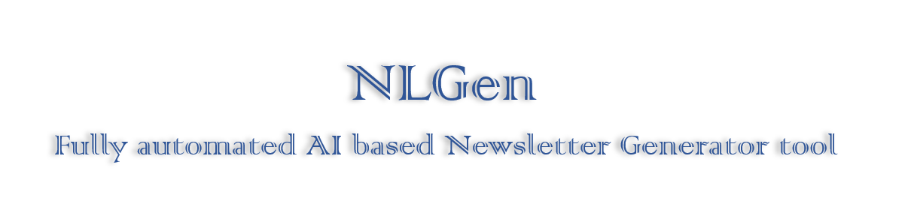

# NLGen - A fully automated AI based NewsLetter Generator
Welcome to NLGen: Tool to generate a Newsletter with categorised articles sourced from the given website links for a given topic.
Tool Link: [Link](https://amitagh-nl-gen-public.hf.space)

It takes following inputs:
* Name: Name for the Newsletter you want to generate.
* Topic: Topic for the Newsletter you want to generate. For eg. AI Tech news or Telecom/Mobility news and so on.
* Sources: Provide links to websites from where you want to get the articles for the newsletter. Use Comma separated urls for multiple ursl. Provide specific urls for the page that contains the article. If on the same portal articles are spread across multiple pages provide url for each page. For eg. https://analyticsindiamag.com/, https://techcrunch.com/category/artificial-intelligence/. 
* Categories: Categories into which you want your articles to be categorized into with one liner explanation of each category. Leave it empty if none. For eg. - Business: All headlines related to new investments, fund raising, revenue or profit numbers, analyst reports related. - New launches: All headlines related to new product launches like LLM launch. - Technical Developments: New ways of LLM training, App development, LLM performance or comparison, new innovations. - Miscellaneous: Headlines related to topic but not fitting in the above categories like regulations, governance.
* Instructions: Any special instructions you want to give an on categorisation. Leave it empty if none. For eg: Prioritize news related to OpenAI, Apple, Google, Amazon, Microsoft related headlines at the top in each category.

After filling the above info press generate button to generate the newsletter. It takes few minutes to collect and filter articles from different sources. Articles are filtered based on article publish date. Only articles from last one week and relevant to the topic are selected. Articles are then categorized based on the categories given.

Some Websites block article collection, in that case no articles will be collected from them.

A html formatted Newsletter will be generated and displayed. You can copy and paste generated newsletter in a mail, word doc or on linkedin. 

An Example of a generated Newsletter is at [link](https://www.linkedin.com/pulse/ai-insights-25th-june-2024-amit-ghadge-9v3gf).

Further improvements and finetuning is being done. Customizations and tuning can be further done as needed.

For any feedback or suggestion please email to amitagh@gmail.com.

